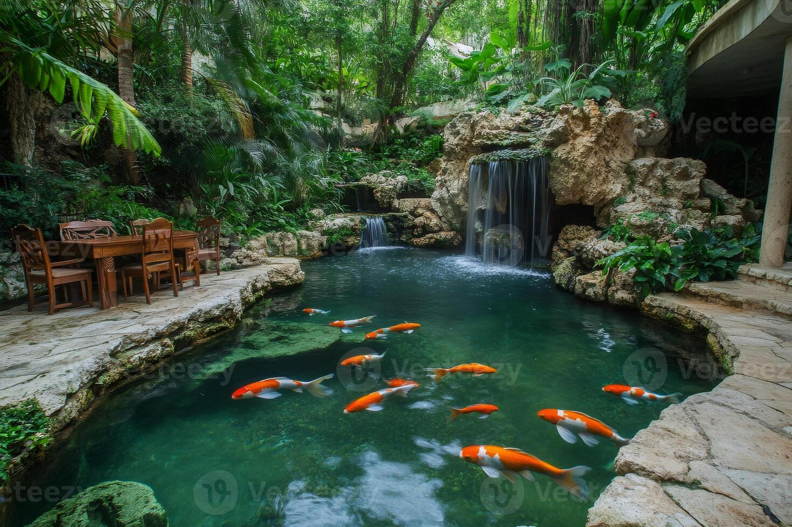
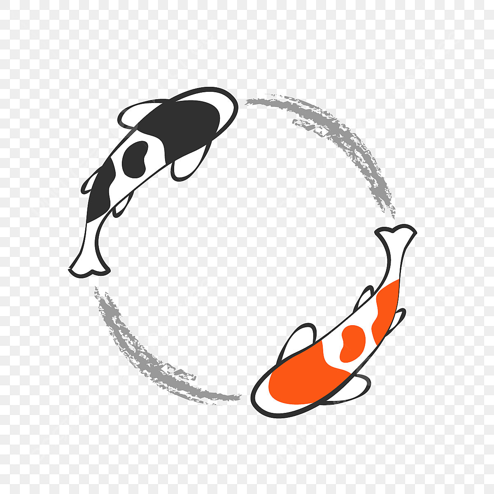

# inspojournal

Add
- clickable house - page for writing - DONE
- popup add quote page - DONE
- make the quotes/inspos fish, they should move around, comes with time stamp - DONE
- nostalgic music (spotify in corner) - people add custom playlist - DONE

- add login - supabase
- how to put quotes on fish
- priorities (buffet 20, cross out bottom 17)
- short, medium, long term goals - (marathon), option to put add themes to put them under
- diff fish to unlock
- option to share each of the pages visible to ur friends
- add todo list? can be like haha I have more stuff to do than u, or send them laughing for not completing something on their todo list to encourage completing stuff
- add option for hidden stuff on todo list then
- choose diff backgrounds/themes (clouds)
- double tap fish it follows you

Fix
- swim faster after just put back in water
- depth for fish swimming
- fish not overlapping?
- spotify popout make the top also in the box

Themes
- page for writing, have some mountain in the distance with a person looking with binoculars takes you to writing when you click it
- grass on edges, clouds drifting by in the sky with the messages
- or have a mountain with clouds drifting around you can move the clouds, click the mountain for the writing page
- a pool with koi fish in it, waterfall, cherry blosson, red pagoda, mount fuji, high up

Draw
- pond, background
- house
- net
- fish
- fish in net

koi inspo: 

*Supabase:*
create table quotes (
  id bigint generated always as identity primary key,
  text text not null,
  created_at timestamp with time zone default now()
)

GRANT SELECT, INSERT ON public.quotes TO anon;
GRANT USAGE ON SCHEMA public TO anon;

GRANT DELETE ON public.quotes TO anon;

